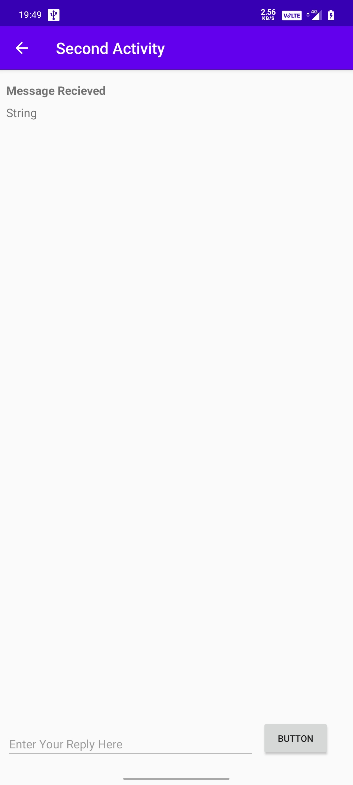
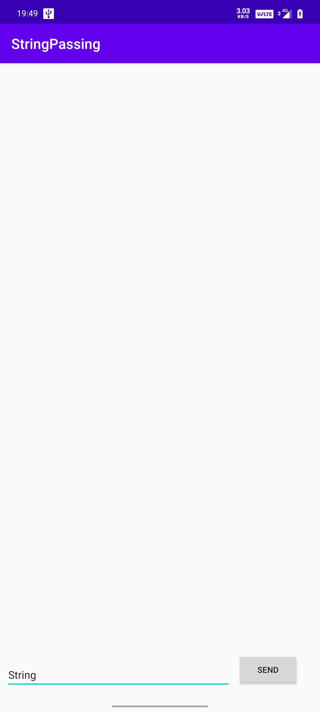
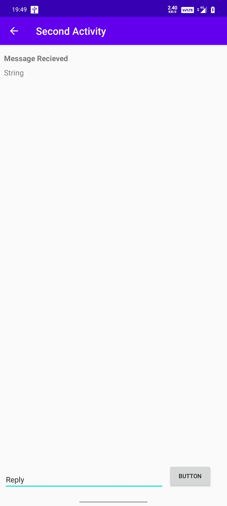
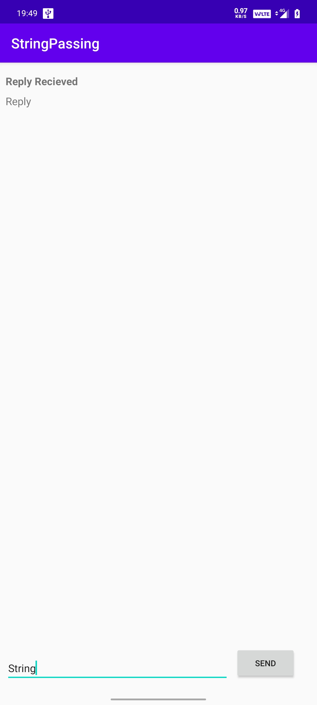

# ANDROID STRING PASSING APP

## What was my goal

I wanted to make an app to learn how to pass data between two activities in Android.

## What I did

- Create a new Android app with a main Activity and a second Activity.
- Pass some data (a string) from the main Activity to the second using an Intent, and display that data in the second Activity.
- Send a second different bit of data back to the main Activity, also using an Intent.
- Implement the various Activity lifecycle callbacks to include logging statements.
- Observe the state changes as the app runs and as I interact with each Activity in I app.
- Modify app to retain the instance state of an Activity that is unexpectedly recreated in response to user behavior or configuration change on the device.

## What I have learned

- How to create a new Activity in Android Studio.
- How to define parent and child activities for Up navigation.
- How to start an Activity with an explicit Intent.
- How to pass data between each Activity with an explicit Intent.
- How the Activity lifecycle works.
- When an Activity starts, pauses, stops, and is destroyed.
- About the lifecycle callback methods associated with Activity changes.
- The effect of actions (such as configuration changes) that can result in Activity lifecycle events.
- How to retain Activity state across lifecycle events.

## Screens
  
  
  
  
  

>This is a companion project to GOOGLE CODELAB's Android fundamentals 02.
